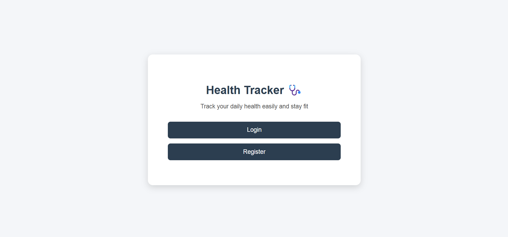
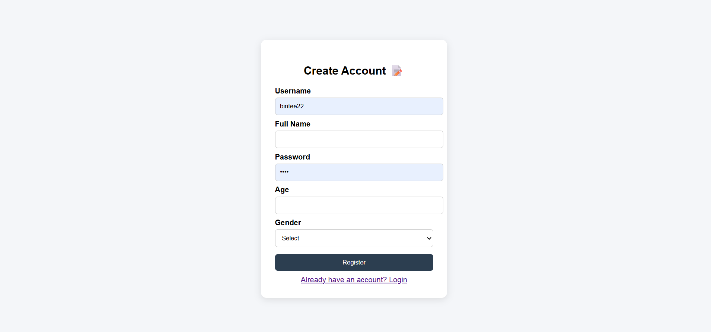
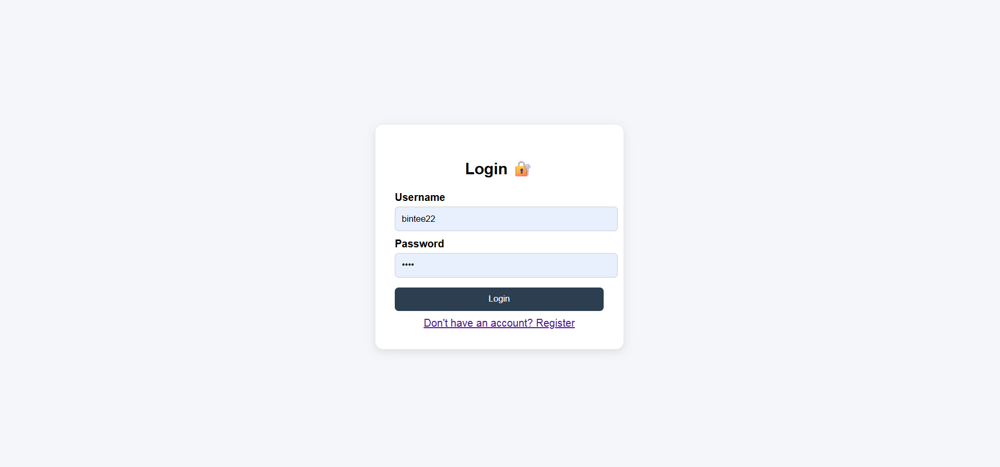
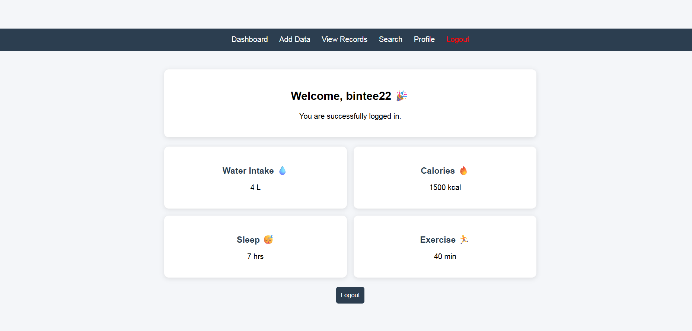
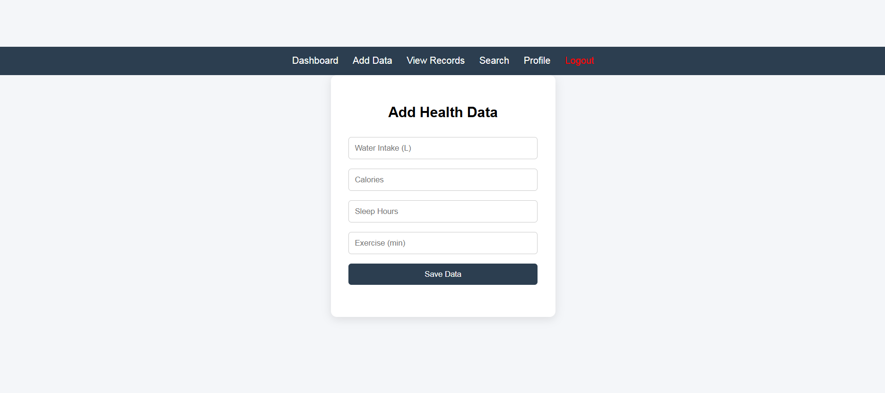
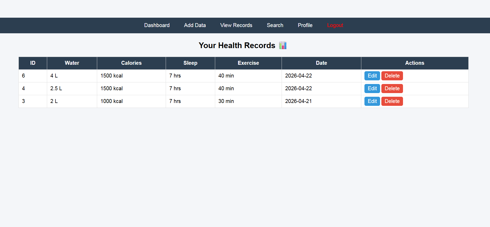
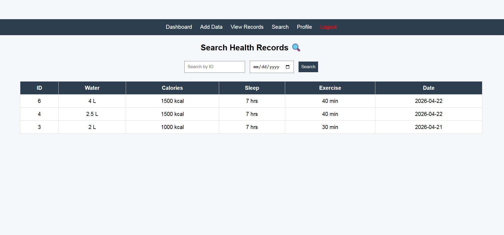
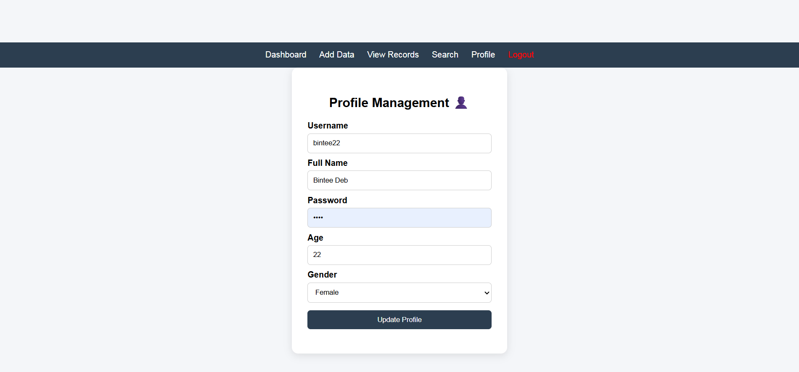
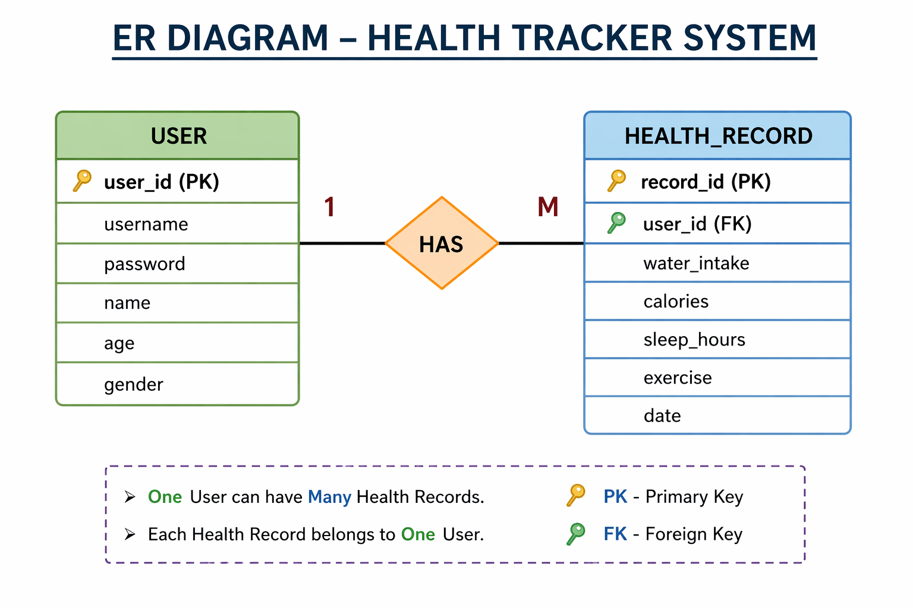

# 🚀 Health Tracker System

---

## 📌 Overview

Health Tracker System is a web-based application that allows users to track their daily health activities such as water intake, calorie consumption, sleep hours, and exercise. The system helps users maintain and manage their health data efficiently.

---

## 👥 Group Details

* **Group Number:** Group 11
* **Course Name:** Database Management System
* **Instructor:** Md. Fahmidur Rahman Sakib

### 🧑‍🤝‍🧑 Team Members

| Name             | ID          | Contribution                             |
| ---------------- | ----------- | ---------------------------------------- |
| Bintee Deb       | 241-115-008 | Backend Development & System Integration |
| Mst Rabina       | 241-115-029 | Frontend Design & UI                     |
| Shormi Rani Nath | 241-115-045 | Database Design & Query Support          |

---

## 🎯 Objective

The objective of this project is to provide a simple and efficient system for users to record, manage, and track their daily health data digitally instead of using manual methods.

---

## ✨ Features

* ✅ User Registration and Login System
* ✅ Add Health Data (Water, Calories, Sleep, Exercise)
* ✅ View Health Records
* ✅ Edit and Update Records
* ✅ Delete Records
* ✅ Search by ID and Date
* ✅ Profile Management

---

## 🖼️ Project Preview

### 🔹 UI Screenshots

### 🔹 ER Diagram

---

## 🏗️ Tech Stack

**Frontend:**
HTML and CSS were used to design a clean and user-friendly interface including forms, dashboard, and navigation system.

**Backend:**
PHP was used to implement system logic including authentication, CRUD operations, and data processing.

**Database:**
MySQL was used to store user data and health records. Two main tables were used: users and health_records with a one-to-many relationship.

## ⚙️ Database Queries Used

* SELECT — to fetch user and health data  
* INSERT — to add new records  
* UPDATE — to modify existing records  
* JOIN — to connect related tables  

---

## 🎥 Vedio

👉https://drive.google.com/file/d/1DnEU5NF0Q4KaR8eSQeyqbvfnYOGvr8KR/view?usp=sharing

---
